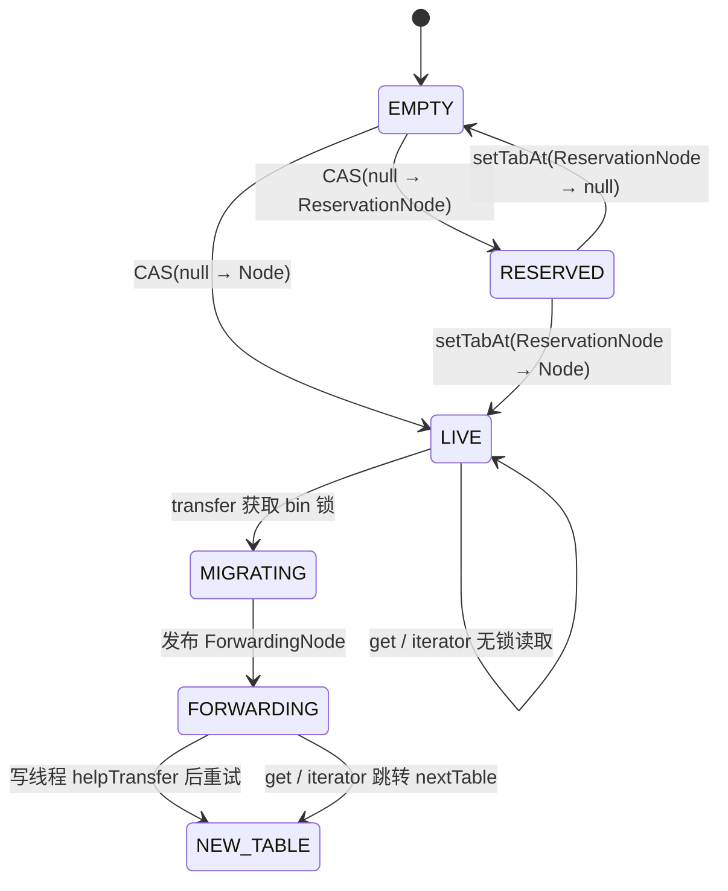

# ConcurrentHashMap 的锁：边界画在哪里

> 能用 CAS，就不加锁；必须加锁时，只锁一个 bin；读路径尽量不加锁。
>
> 本文基于 JDK 8（Corretto 8.412）源码，讨论的是实现机制，不代表所有 JDK 版本都完全相同。

很多文章会直接回答“ConcurrentHashMap（CHM）用了什么锁”。更准确的问题是：**一次操作到底触碰了多大的共享结构，哪些变化必须互斥，哪些变化可以靠 CAS 和 volatile 完成？**

JDK 8 的答案集中体现在 `putVal`：空 bin 用 CAS，遇到扩容就协作迁移，只有修改已有 bin 的结构时才锁住 bin 头节点。

## 1. 先看契约：CHM 对调用者承诺什么

理解锁边界之前，先把实现细节翻译成可观察的行为。以下契约是后面状态机和 CAS 设计必须兑现的约束：

| # | 契约 | 对调用者意味着什么 |
|---|---|---|
| 1 | 单键更新原子 | `put`、`remove`、`replace` 等对单个 key 的更新不会被观察到“半次修改”；但它们不构成多 key 事务。 |
| 2 | `get` 不阻塞普通写入 | 纯读取通常不获取 bin 互斥锁；读到的是已发布结构，不保证全局快照。 |
| 3 | 迭代器弱一致 | 不抛 `ConcurrentModificationException`，但可能看不到遍历期间插入的元素，也不承诺某个时刻的完整视图。 |
| 4 | 复合方法不是纯读 | `computeIfAbsent`、`compute`、`merge` 可能执行映射函数、CAS 占位或获取 bin 锁；映射函数不应依赖对同一 map 的递归更新。 |
| 5 | `computeIfAbsent` 至多一次进行同 key 计算 | 对同一 key 的并发缺失计算通过 `ReservationNode` 串行化；函数返回 `null` 不建立映射，抛异常也会清理占位。 |
| 6 | `null` 键和值被禁止 | `put(null, v)`、`put(k, null)` 等直接抛 `NullPointerException`，`null` 也不能作为“缺失值”返回。 |
| 7 | 扩容对调用者透明 | 读者会沿 `ForwardingNode` 找到新表，写者可能帮助迁移后重试；调用者不需要等待整张表迁移完成。 |
| 8 | 计数查询是瞬时观察 | `size()`、`isEmpty()`、`mappingCount()` 不与后续操作组成原子判断，不能用于“检查后再行动”的并发协议。 |

其中最容易被误读的是第 2、4、5 条：**不获取 bin 锁的是纯读路径，不是所有名字带“get”或“Absent”的方法；`computeIfAbsent` 是读后写（read-modify-write）操作。**

## 2. 锁的粒度，跟着数据结构走

| 实现 | 主要锁范围 | 结果 |
|---|---|---|
| `Hashtable` | 整张表 | 不同键的操作也互相阻塞 |
| JDK 7 `ConcurrentHashMap` | 一个 segment | 并发度受 segment 数量限制 |
| JDK 8 `ConcurrentHashMap` | 一个 bin 的头节点 | 不同 bin 可以并行，空 bin 无需加锁 |

JDK 8 不再把表切成固定数量的 segment，而是把锁下沉到发生结构变化的 bin。这里的“一个 bin”通常是一条链表，冲突严重时也可能是 `TreeBin`。因此，锁的粒度不是固定的“一个桶”，而是**当前 bin 的结构一致性范围**。

这也解释了为什么 JDK 8 的并发度通常更高：两个线程操作不同 bin 时，不需要争用同一把锁；只有哈希冲突落到同一 bin，或者操作触及同一结构时，才会产生竞争。

## 3. 三种同步手段，各自负责什么

CHM 并不是“用了一把很细的锁”，而是把不同问题交给不同机制：

| 机制 | 解决的问题 | 典型位置 |
|---|---|---|
| `volatile` | 让线程看到已发布的状态 | 表槽位、`Node.val`、`Node.next` |
| CAS | 原子地翻转一个槽位或计数状态 | 空 bin 插入、`sizeCtl`、`transferIndex`、计数 |
| `synchronized` | 保护一段结构性修改 | 链表插入/删除、树操作、bin 迁移 |

可以把它们理解成三种不同范围的保证：

- 一个字段的可见性，用 `volatile`；
- 一个槽位或整数状态的一次变更，用 CAS；
- 一条链或一棵树的结构改动，用锁。

所以，锁的边界不是由“有没有并发”决定的，而是由“这次写入会不会破坏共享结构”决定的。

## 4. `putVal`：锁只出现在一个分支

一次普通 `put` 定位到 bin 后，大致会走下面三条路径：

```text
tabAt(tab, i) == null ?
  是 -> CAS 把新节点放入空 bin                 （不加锁）
  否 -> f.hash == MOVED ?
          是 -> helpTransfer，迁移后重试          （协作扩容）
          否 -> synchronized (f)，修改已有 bin   （加 bin 锁）
```

这里有两个关键细节。

第一，空 bin 没有需要维护的链表或树，CAS 只需完成“空槽 -> 新节点”的一次状态翻转，因此不必先取得锁。

第二，进入 `synchronized (f)` 后还要再次检查 `tabAt(tab, i) == f`。这是双检：线程排队等锁期间，另一个线程可能已经完成迁移，把旧头节点替换成 `ForwardingNode`。如果双检失败，当前线程不能继续修改旧 bin，只能重新读取并重试。

因此，`putVal` 的控制流可以概括成一句话：**能 CAS 就不锁，遇到迁移就帮忙，只有修改现有结构才锁。**

`computeIfAbsent` 的空 bin 路径略有不同：它先 CAS 放入一个 `ReservationNode`，把这个槽位标记为“正在计算”，再在占位节点上执行映射函数。这样其他线程不会同时对同一个空 bin 重复计算。

## 5. 状态机：一个 bin 如何从空槽走到新表

状态机里需要单独画出 `RESERVED`，否则会漏掉 `computeIfAbsent` 的关键同步步骤：



这里有三条容易忽略的路径：

1. `EMPTY -> RESERVED` 由 CAS 完成，但映射函数并不是在 CAS 内执行，而是在占位节点的同步保护下执行；
2. 映射函数返回 `null`，或者执行过程中抛出异常时，`ReservationNode` 会被清理，槽位回到 `EMPTY`；
3. 对已经存在的 bin，`computeIfAbsent` 会在对应 bin 锁内查找并计算，不会再走 `ReservationNode` 路径。

因此，`computeIfAbsent` 同时体现了两种同步手段：**CAS 负责占住空槽，锁负责保护计算期间的结构和可见状态。**

如果 Markdown 阅读器不支持 Mermaid，可以按下面的纯文本理解：

```text
EMPTY
  ├─ CAS(null → Node) -------------------------------> LIVE
  └─ CAS(null → ReservationNode) ---------------------> RESERVED
                              ├─ setTabAt(ReservationNode → Node) ----> LIVE
                              └─ setTabAt(ReservationNode → null) ----> EMPTY

LIVE --transfer + bin lock--> MIGRATING --publish FWD--> FORWARDING --> NEW_TABLE
```

## 6. CAS 状态变化：谁在改什么，失败意味着什么

CHM 里的 CAS 不是一种单一操作。它们可以分成三类：**抢占数据槽位、推进扩容控制状态、更新分散计数**。只有第一类直接改变 bin 状态；后两类改变的是全局控制变量或统计变量。

### 6.1 bin 槽位的状态变化：CAS 抢占，volatile 发布

| 场景 | 原子变化 | 成功后 | 失败后 |
|---|---|---|---|
| 普通 `put` 插入空 bin | **CAS**：`tab[i]: null -> Node` | 映射建立，线程结束本次插入 | 说明别的线程先占了槽位，重新读取并走链表 / 树 / 迁移分支 |
| `computeIfAbsent` 占位 | **CAS**：`tab[i]: null -> ReservationNode` | 当前线程独占该空槽的计算权 | 说明槽位已被其他线程占用，重新读取；不会重复占位 |
| 映射完成或回滚 | **volatile 写**：`ReservationNode -> Node / null` | 发布计算结果，或清除占位恢复空槽 | 不存在 CAS 失败；写入受 `synchronized (r)` 保护 |
| 迁移发布 | **volatile 写**：`tab[i]: oldBin -> ForwardingNode` | 旧 bin 对写者和读者转发到新表 | 双检失败时不发布，说明已有线程改变了槽位，当前迁移者放弃该 bin |

空 bin 的 CAS 是一个典型的“竞争裁决点”：它不是为了保护一段长代码，而是为了让**一个槽位只能有一个首个写入者**。CAS 失败不是异常，而是状态机告诉线程“你看到的旧状态已经过期”。迁移则采用“锁内构造、volatile 最后发布”的方式，不需要对旧槽位再做一次 CAS。

### 6.2 扩容控制状态的 CAS

| 变量 | 典型变化 | 作用 |
|---|---|---|
| `sizeCtl` | `0 / 正常阈值 -> 负数扩容标记`；扩容完成后恢复为新阈值 | 选出初始化/扩容协调者，记录参与迁移的线程数和 resize stamp |
| `transferIndex` | `高下标 -> 更小下标` | 多个迁移线程分段领取 bin 范围；每次 CAS 成功表示领取了一段工作 |
| `table` 初始化 | **CAS**：`sizeCtl: 初始阈值 -> -1`；随后 volatile 发布 `table` | 只有一个线程负责初始化，其他线程观察控制状态后继续 |

这些 CAS 不直接给用户的 key 建立映射，但它们决定了 bin 是否进入 `MIGRATING`、谁负责迁移哪一段，以及新表何时可见。

### 6.3 计数路径的 CAS

`addCount` 会优先更新 `baseCount`；竞争激烈时转向 `CounterCell` 数组。对应的 CAS 可能是：

```text
baseCount: 旧计数 -> 旧计数 + delta
CounterCell.value: 旧分片计数 -> 旧分片计数 + delta
cellsBusy: 0 -> 1       （争抢初始化 / 扩容 CounterCell 数组）
```

计数 CAS 失败只表示发生了竞争，需要重试或转移到其他计数单元；它不代表某个 key 的更新失败。最终 `size()` 是多个计数单元的求和，因此只能作为瞬时观察。

### 6.4 CAS 与锁的边界

```text
CAS：一次状态翻转，决定“谁先占住”或“谁先领取工作”
锁：一段结构修改，保证链表 / TreeBin / ReservationNode 期间不被并发破坏
volatile：发布已经构造好的状态，让读者看到前后完整结构
```

三者不是替代关系：`computeIfAbsent` 先用 CAS 把 `EMPTY` 变成 `RESERVED`，再用 `synchronized (r)` 保护映射函数和 volatile 收尾发布；扩容先用 bin 锁构造新 bin，最后用 volatile 写发布 `ForwardingNode`；读操作只消费这些已发布状态。

状态机中的 `MIGRATING` 是一个**逻辑中间态**：旧表槽位仍然可能暂时指向原 bin，真正对外可观察的边界是最后那次 `oldBin -> ForwardingNode` 的 volatile 发布。

## 7. 扩容：迁移者和写者使用同一把 bin 锁

JDK 8 扩容时不会原地重排旧链表，而是把一个旧 bin 拆到新表的两个位置：`i` 和 `i + n`。迁移完成后，旧表对应槽位才会被替换成 `ForwardingNode`。

```text
[旧 bin] --(双检 + 拆分 + 发布)--> [新表的 i / i+n]
    |
    +-----------------------------> [旧表槽位 = ForwardingNode]
```

对同一个 bin，迁移和普通写入都以旧 bin 头节点 `f` 为锁对象，并使用同一个双检：

1. 确认旧表槽位仍然指向 `f`；
2. 在锁内构造并发布新表中的两个 bin；
3. 最后把旧表槽位发布为 `ForwardingNode`。

这样，写线程看到的状态只有两种：迁移前，继续修改旧 bin；迁移后，沿 `ForwardingNode` 转到新表。不存在“旧链已经被拆了一半、写线程同时修改它”的中间状态。

扩容本身也不是一条线程独占完成的。线程撞到 `ForwardingNode` 后会调用 `helpTransfer`，通过 CAS 从 `transferIndex` 领取一段工作。锁只负责同一个 bin 的互斥，不同 bin 的迁移仍可以并行。

## 8. 读路径为什么通常不需要锁

`get`、`containsKey` 和迭代器不会取得 bin 锁；它们通过 volatile 读取表槽位、节点值和后继指针。迁移也不直接改写旧链，而是先构造新结构，最后用 volatile 写发布 `ForwardingNode`。

因此，读线程要么看到一个完整的旧 bin，要么看到 `ForwardingNode` 并跳到新表，不会读到“拆了一半”的链。

但“读无锁”不等于“读到精确快照”：

- 迭代器是弱一致的，可能看不到遍历期间插入的元素；
- `size()` / `isEmpty()` 在并发修改时只能反映某个瞬间的近似状态；
- 批量操作也不提供全局一致视图。

这是 CHM 的设计交换：用不可变式发布和弱一致契约，换取读路径不阻塞写路径。**读无锁不是免费得到的，它把一致性要求交给了 API 契约。**

需要注意“通常”二字：`compute`、`merge` 等复合更新属于写操作，仍会在相应 bin 上执行同步；计数维护也会使用 CAS 和 `CounterCell`，不能简单归类为一次普通 volatile 读取。

## 9. 三个结论

1. **锁的粒度由结构决定。** JDK 8 锁的是发生结构变化的 bin，而不是整张表。
2. **锁保护的是结构，不是“并发”本身。** 空槽的一次 CAS 不需要锁，链表或树的改动才需要互斥。
3. **无锁读对应弱一致性。** CHM 不承诺遍历、计数和批量操作构成同一时刻的全局快照。

## 附录：源码切片（JDK 8）

```java
// putVal：空 bin 用 CAS，迁移时协作，已有结构才加锁
if (f == null) {
    casTabAt(tab, i, null, new Node<K,V>(hash, key, value, null));
} else if ((fh = f.hash) == MOVED) {
    tab = helpTransfer(tab, f);
} else {
    synchronized (f) {
        if (tabAt(tab, i) == f) { // 双检
            // 修改链表或 TreeBin
        }
    }
}

// computeIfAbsent：空 bin 先 CAS 占位，再在 ReservationNode 上计算
if (f == null) {
    ReservationNode<K,V> r = new ReservationNode<K,V>();
    synchronized (r) {
        if (casTabAt(tab, i, null, r)) {
            Node<K,V> node = null;
            try {
                V v = mappingFunction.apply(key);
                if (v != null)
                    node = new Node<K,V>(hash, key, v, null);
            } finally {
                setTabAt(tab, i, node); // node 为 null 时清理 ReservationNode
            }
        }
    }
}

// transfer：新结构准备好后，最后发布 ForwardingNode
synchronized (f) {
    if (tabAt(tab, i) == f) {
        // 构造 nextTab[i] 和 nextTab[i + n]
        setTabAt(tab, i, fwd);
    }
}

// 读路径依赖 volatile 可见性
volatile V val;
volatile Node<K,V> next;
```
