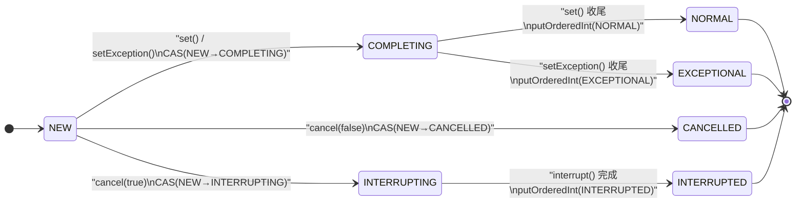

# FutureTask 的状态机：一个 volatile int 承载的七态机

FutureTask 没有锁、没有 AQS，只有四个字段——其中最核心的是一个volatile int state。
结果如何发布、取消是否生效、getter 何时醒来、中断如何送达，全部由这一个 int 裁决。
本文分两层看它：先把 FutureTask 当黑盒，盘点它对外承诺了什么（契约）；再拆开实现，看状态机怎么兑现这些承诺。

---

## 一、契约清单

不看一行实现，只从 `Future` 接口 javadoc、`FutureTask` 的公开行为与可观测事实出发，它对外承诺了以下契约：

| # | 承诺 | 细节 |
|---|---|---|
| 1 | 至多执行一次 | `run()` 对底层 Callable/Runnable 至多执行一次；重复调用是 no-op。一旦完成，任务不可重启、不可再取消（唯一例外是 protected 的 `runAndReset()`，供周期任务复用，见 §2）。 |
| 2 | 结果持久 | 完成之后（无论正常、异常还是取消），结局永远保持，不会回退。 |
| 3 | get() 的四种出口 | 未完成则阻塞；正常完成 → 返回值（可为 null）；底层抛异常 → `ExecutionException`（cause 为原始异常，包括 Error）；被取消 → `CancellationException`；等待中自身被中断 → `InterruptedException`（并消费中断标志）。 |
| 4 | 超时是尽力而为 | `get(timeout)` 到点抛 `TimeoutException`，但不保证严格按时——见 §10 的 COMPLETING 窗口。 |
| 5 | cancel() 的赢家语义 | 返回 `true` 意味着"取消赢了"：此后 `isCancelled()` 恒为 true、`get()` 必抛 `CancellationException`。返回 `false` 则什么都不能推断——可能已完成、可能正在完成、可能已被别人取消。 |
| 6 | 中断只是"尝试" | `cancel(true)` 会中断正在运行的线程，但不保证任务停止——任务必须自己响应中断。取消后任务线程仍可能继续跑。 |
| 7 | 中断不泄漏 | 取消产生的中断只会在任务运行期间送达。JDK 8 的 revision note 明确写了这是相对旧版 AQS 实现的修复："avoid surprising users about retaining interrupt status during cancellation races"。 |
| 8 | 可见性 | 任务写下的结果/异常，`get()` 返回时必然可见（happens-before 链）。 |
| 9 | done() 回调 | protected `done()` 在任务终结时被调用一次；回调内可查 `isCancelled()`。执行线程是"完成任务的那个线程"（runner 或 cancel 调用者），无契约保证。 |
| 10 | isDone() 是单行道 | 一旦为 true 永远为 true。JDK 9+ 还强化为：isDone() == true 时，get() 不抛 InterruptedException、也不会超时——这是 §10 里官方修出来的契约（JDK 8 有竞态窗口违约）。 |

## 二、三个反直觉的行为

> **1. cancel() 返回 true ≠ 任务已停止。** 取消赢的是"状态"，不是"任务"。callable 不响应中断时，任务会继续跑完——但它的结果永远被丢弃：等它返回时 set() 的写入已经输掉（§9），get() 只能看到 CancellationException。

> **2. isDone() == true 的时刻，get() 不一定"马上有结果"。** JDK 8 中 `isDone() = state != NEW`，而 COMPLETING（结果写入中）也算 done——Paul Sandoz 在 JDK-8073704 里给出了病理复现：`while (!f.isDone()); Thread.currentThread().interrupt(); f.get()` —— 在 JDK 8 上会观察到 `InterruptedException`：isDone 已经说"完成了"，get 却抛"等待被中断"。JDK 9 修复了 get() 侧（§10），isDone 的语义保留。

> **3. runAndReset() 是"可重跑"的例外，但脆弱。** 它是给 `ScheduledThreadPoolExecutor` 做周期任务用的：执行但不保存结果，完成后回到 NEW 允许再跑。但一旦执行中抛异常或任务被取消，它进入终态且返回 false——"可重置"只有在干干净净跑完时才成立。

## 三、七个状态，一个 int

源码注释给出了全部可能转移：

```
Possible state transitions:
 * NEW -> COMPLETING -> NORMAL
 * NEW -> COMPLETING -> EXCEPTIONAL
 * NEW -> CANCELLED
 * NEW -> INTERRUPTING -> INTERRUPTED
```

| 值 | 状态 | 终态？ | 含义 | 谁写入 |
|---|---|---|---|---|
| 0 | NEW | 否 | 初始态：任务未跑 / 正在跑。唯一能"离开"的状态 | 构造器 |
| 1 | COMPLETING | 否 | 结果写入中：CAS 赢家正在写 `outcome` | set / setException |
| 2 | NORMAL | 是 | 正常完成，`outcome` = 结果 | set |
| 3 | EXCEPTIONAL | 是 | 异常完成，`outcome` = Throwable | setException |
| 4 | CANCELLED | 是 | 无中断取消（cancel(false)） | cancel |
| 5 | INTERRUPTING | 否 | 取消且要求中断：interrupt() 正在送达 | cancel（CAS 后、interrupt 前） |
| 6 | INTERRUPTED | 是 | 中断已送达（interrupt() 调用完成） | cancel（interrupt 完成后） |

## 四、状态值编码设计

7 个常量不是随便编号的——每个判断都是和某个阈值比较，一次比较就能回答一个查询，这才是"一个 int 承载状态机"的底气：

| 0 | 1 | 2 | 3 | 4 | 5 | 6 |
|---|---|---|---|---|---|---|
| NEW | COMPLETING | NORMAL | EXCEPTIONAL | CANCELLED | INTERRUPTING | INTERRUPTED |
| 初始 | 中间态 | 终态 | 终态 | 终态 | 中间态 | 终态 |

```java
isDone()      == (state != 0)   // COMPLETING 也算 done！
get() 快路径  == (state > 1)    // 直接 report，不等待
isCancelled() == (state >= 4)   // INTERRUPTING 期间即视为已取消
run() 收尾    == (state >= 5)   // 取消带了中断，走中断握手（§7）
report()      == 2 返回值；>= 4 抛 CancellationException；== 3 抛 ExecutionException
```

一个直接推论：`get()` 看到 INTERRUPTING（5）时不会等待——它 > COMPLETING，直接 report 抛 CancellationException。取消已赢，结果不可能再回来，没必要等 INTERRUPTED 落定。

## 五、四条转移路径：CAS 与 ordered write 的分工



分工规律：离开 NEW 必须 CAS（set / setException / cancel 三路竞争，只能有一个赢家）；中间态 → 终态用 putOrderedInt（ordered/lazy write）。源码注释解释了后者：

> "Transitions from these intermediate to final states use cheaper ordered/lazy writes because values are unique and cannot be further modified"

终态值唯一、方向唯一、只被赢家写一次，不需要 full fence，release 语义足够。

## 六、为什么需要中间态（一）：COMPLETING 是"单写者门牌"

`outcome` 不是 volatile（注释原话："non-volatile, protected by state reads/writes"）。为什么安全？因为只有一个线程能写它——CAS(NEW → COMPLETING) 的赢家。COMPLETING 就是把"结果写入临界区"挂出去的门牌：

```java
protected void set(V v) {
    if (UNSAFE.compareAndSwapInt(this, stateOffset, NEW, COMPLETING)) {
        outcome = v;                                   // 普通写——只有赢家到达这里
        UNSAFE.putOrderedInt(this, stateOffset, NORMAL); // release 语义：outcome 先于 state 可见
        finishCompletion();                            // 唤醒所有等待者
    }
}
```

输家（另一个完成路径、或 cancel）看到 state ≠ NEW，直接放弃。这就是"结果 vs 取消"的裁决方式：谁先 CAS 谁赢，赢家写 outcome，输家闭嘴。

COMPLETING 还有第二个用途：给 getter 一个"快好了"的信号。awaitDone 里遇到 COMPLETING 不 park、不超时，只 `Thread.yield()` 自旋——状态马上变终态，park/unpark 的开销不值当。JDK 8 的注释是 "cannot time out yet"，JDK 9 改成更直白的承诺（§10）。

## 七、为什么需要中间态（二）：INTERRUPTING

`cancel(true)` 的三步：CAS 到 INTERRUPTING → 读 runner 执行 `t.interrupt()` → finally 里 putOrderedInt(INTERRUPTED)。

INTERRUPTING 存在的意义，是让 runner 线程能等到 interrupt() 调用真正完成。run() 的收尾（finally）有一段顺序极其讲究的代码：

```java
finally {
    // runner must be non-null until state is settled to
    // prevent concurrent calls to run()
    runner = null;
    // state must be re-read after nulling runner to prevent
    // leaked interrupts
    int s = state;
    if (s >= INTERRUPTING)
        handlePossibleCancellationInterrupt(s);
}
```

为什么顺序不能颠倒？设想取消与任务完成竞态：cancel 读 runner 拿到任务线程（非 null）准备 interrupt()；同一瞬间任务跑完进 finally。如果先读 state 再置 runner=null，cancel 侧可能拿到已经退役的线程去 interrupt——中断标志会留在线程池 worker 上，污染下一个任务，这就是注释里的 "leaked interrupts"。解法：runner 先置 null，再重读 state——此时若 state ≥ INTERRUPTING，说明 cancel 已经赢了且 interrupt() 可能尚未完成，于是：

```java
private void handlePossibleCancellationInterrupt(int s) {
    // It is possible for our interrupter to stall before getting a
    // chance to interrupt us.  Let's spin-wait patiently.
    if (s == INTERRUPTING)
        while (state == INTERRUPTING)
            Thread.yield(); // wait out pending interrupt
}
```

> **洞察：** INTERRUPTING → INTERRUPTED 是一个两线程握手——cancel 线程执行 interrupt() 并落定终态，runner 线程 spin 等到 INTERRUPTED 才退出 run()。结果：中断只可能在任务运行期间送达（要么被任务消费——响应取消；要么中断发生在任务还活着时），绝不留到任务退出之后。契约 #7"中断不泄漏"就是这样兑现的。注意这个 spin 是无界 Thread.yield()——但只发生在取消竞态窗口，代价可接受。

## 八、等待与唤醒：Treiber 栈 + awaitDone 循环

等待者用 `WaitNode`（只有 thread + next 两个字段）组成 Treiber 栈。

```java
for (;;) {
    if (Thread.interrupted()) {
        removeWaiter(q);
        throw new InterruptedException();
    }
    int s = state;
    if (s > COMPLETING) {
        if (q != null) q.thread = null;
        return s;
    }
    else if (s == COMPLETING) // cannot time out yet
        Thread.yield();
    else if (q == null)
        q = new WaitNode();
    else if (!queued)
        queued = UNSAFE.compareAndSwapObject(this, waitersOffset,
                                             q.next = waiters, q);
    else if (timed) {
        nanos = deadline - System.nanoTime();
        if (nanos <= 0L) {
            removeWaiter(q);
            return state;
        }
        LockSupport.parkNanos(this, nanos);
    }
    else
        LockSupport.park(this);
}
```

分支一览：

- **Thread.interrupted()？** 被中断 → 摘节点、抛 InterruptedException
- **s > COMPLETING？** 终态 → `q.thread = null`（不摘链，留给别人）→ 返回状态
- **s == COMPLETING？** yield 自旋，不 park 不超时
- **q == null？** 建节点（构造时记当前线程）
- **!queued？** CAS 压栈：`q.next = waiters; CAS(waitersOffset, q.next, q)`
- **timed？** 算剩余时间 → parkNanos；超时 → removeWaiter + 返回 state
- **否则** LockSupport.park 无限期

唤醒侧是 `finishCompletion()`：CAS 把整条栈取走（`waiters = null`）→ 沿链逐个 `q.thread = null; LockSupport.unpark(t)` → `done()` 回调 → `callable = null`（reduce footprint）。等待者的清理是"懒惰的"：`removeWaiter` 用 thread=null 标记 + 双指针摘链 + retry（并发摘除竞态时重来）——超时/中断的节点不主动通知别人，留给路过的人顺手清理。

## 九、竞态裁决：CAS 单赢制

整个类的并发正确性归结为三场"只有一个人能赢"的比赛：

| 竞态 | 裁决点 | 输家 | 后果 |
|---|---|---|---|
| set vs setException vs cancel | CAS(state, NEW, COMPLETING / CANCELLED / INTERRUPTING) | 输家直接 return | 结果与取消互斥：cancel 赢了结果被永久丢弃；set 赢了 cancel 返回 false（但可能 get 已赢——看谁先） |
| run() vs run() | CAS(runner, null, 当前线程) | 第二个执行者直接 return | 任务至多被一个线程执行；runner 非空 = 已有人在跑 |
| get 入栈 vs finish 摘栈 | CAS(waiters, 旧栈顶, 新节点) | 输家重读重试 | 等待者要么在栈里被唤醒，要么看到终态自己走——不会丢唤醒 |

一个容易误读的细节：`setException` 并不检查"是否被取消"——它只做 CAS(NEW→COMPLETING)。如果 cancel 已经赢了，CAS 失败，异常被静默丢弃。错误检测不是"检查"，而是"CAS 失败"本身。整个类没有一处 if (cancelled) 式的检查，全靠状态机裁决。

## 十、契约修订：JDK-8073704 与 JDK 9 的 awaitDone 重排

§2 提到的"isDone()==true 却抛 InterruptedException"不是设计错误那么简单——它触发了官方一场关于契约的讨论（JDK-8073704）。争论过程本身很有价值：

- **David Holmes：** j.u.c 惯例是"中断优先"——取消点稀少，中断必须被传达；任务的完成与调用者的中断是两回事
- **Martin Buchholz（转变后）：** "If isDone() returns true, then get() should surely return the value without throwing IE."
- **Doug Lea：** isDone() 保持 state != NEW（"It's intentional"）——不动 isDone，改 get()
- **最终修复（JDK 9）：** awaitDone 循环里把 state 读与 COMPLETING 分支挪到中断检查之前，注释改为 "We may have already promised (via isDone) that we are done so never return empty-handed or throw InterruptedException"

```java
// 修复后的顺序（JDK 9+）：先读状态，再查中断
for (;;) {
    int s = state;
    if (s > COMPLETING) { ... return s; }
    else if (s == COMPLETING)
        // We may have already promised (via isDone) that we are done
        // so never return empty-handed or throw InterruptedException
        Thread.yield();
    else if (Thread.interrupted()) {
        removeWaiter(q);
        throw new InterruptedException();
    }
    ...
}
```

> 这次修订让黑盒契约变得更诚实：只要 get() 见过 COMPLETING（即 isDone() 已承诺"要完了"），它要么返回结果、要么抛 ExecutionException/CancellationException，绝不再抛中断、绝不超时空手而归。代价是放弃"中断优先"惯例——因为 isDone() 的承诺优先于调用者的中断。isDone() 本身保持 state != NEW：它的"done"语义是"不会回到 NEW"，不是"结果可立即取出"——两者之间隔着 COMPLETING 这个短暂窗口，这是设计者明确保留的。

## 十一、从黑盒视角理解：只用 Future 接口推断状态

黑盒视角不是纯理论——很多框架和调试工具需要"不看实现地探测一个 Future 的状态"，把任意 Future 归一化成"运行中 / 已取消 / 成功 / 失败"四态。这类探测工具只用三个探针：`isDone()`、`isCancelled()`、`get()`，且顺序不能乱：

```java
// 伪代码：黑盒状态探测的典型实现
if (!future.isDone())          return RUNNING;
if (future.isCancelled())      return CANCELLED;
try {
    future.get();              return SUCCESS;
} catch (ExecutionException e) {
    return FAILED;
} catch (InterruptedException e) {
    Thread.currentThread().interrupt();   // 恢复中断标志
    return FAILED;
}
```

四个细节值得单独说：

**1. 探测顺序是契约的体现。** 先 `isDone()` 短路——未完成直接判定 RUNNING，避免触发 `get()` 的阻塞（"未完成时 get 会阻塞"是黑盒契约，探测工具必须绕过）；再 `isCancelled()`——它比 `get()` 更廉价，且不需要处理异常；最后才用 `get()` 区分成败。顺序反过来就会踩坑：先 `get()` 会在未完成时无限期阻塞，先 `isCancelled()` 会在已取消但未完成的状态上误判（取消后任务可能还在跑）。

**2. RUNNING 是一个大杂烩。** 黑盒只能看到 4 个可观测状态，白盒的 7 态坍缩成它——未提交、运行中、COMPLETING 写入中、甚至 INTERRUPTING 中断送达中，全部归入 RUNNING。黑盒无法区分"即将完成"与"刚启动"，探测结果天然是滞后的。

**3. InterruptedException 要 restore 中断标志。** `get()` 抛中断只说明"调用线程被打断"，与任务本身无关——这可能是调用者自身的取消信号。探测工具吞掉它等于吞掉调用方的取消意图；标准做法是 `Thread.currentThread().interrupt()` 把标志补回去再返回。这是"黑盒"的纪律：探测方不应该改变调用方的线程状态。

**4. 探测工具必须容忍的竞态窗口。** JDK 8 下 isDone()==true 之后 get() 仍可能抛 InterruptedException（JDK-8073704 修复前），所以"done 却抛中断"是探测代码必须当作正常输入处理的情况——这正是那个 JDK 9 修复要消灭的坑，也说明黑盒代码在旧 JDK 上要比契约更保守。

顺带一提，"取异常"型的探测工具（拿到失败任务的 cause）同样要遵守黑盒纪律：先 `isDone()` 防阻塞，再 `isCancelled()` 短路（取消没有异常可取），最后 `get()` 解包 `ExecutionException.getCause()`——因为契约里失败的原因永远包在 ExecutionException 里，直接读实现字段是黑盒越界。

##  JDK 8 源码关键段

```java
// 状态常量与转移注释（类头）
private volatile int state;
private static final int NEW          = 0;
private static final int COMPLETING   = 1;
private static final int NORMAL       = 2;
private static final int EXCEPTIONAL  = 3;
private static final int CANCELLED    = 4;
private static final int INTERRUPTING = 5;
private static final int INTERRUPTED  = 6;
// Possible state transitions:
// NEW -> COMPLETING -> NORMAL
// NEW -> COMPLETING -> EXCEPTIONAL
// NEW -> CANCELLED
// NEW -> INTERRUPTING -> INTERRUPTED

// 结果写入：CAS 赢家独占 outcome
protected void set(V v) {
    if (UNSAFE.compareAndSwapInt(this, stateOffset, NEW, COMPLETING)) {
        outcome = v;
        UNSAFE.putOrderedInt(this, stateOffset, NORMAL); // final state
        finishCompletion();
    }
}

// 取消：CAS 抢占 → 中断 → 落定终态（finally 保证）
public boolean cancel(boolean mayInterruptIfRunning) {
    if (!(state == NEW &&
          UNSAFE.compareAndSwapInt(this, stateOffset, NEW,
              mayInterruptIfRunning ? INTERRUPTING : CANCELLED)))
        return false;
    try {    // in case call to interrupt throws exception
        if (mayInterruptIfRunning) {
            try {
                Thread t = runner;
                if (t != null)
                    t.interrupt();
            } finally { // final state
                UNSAFE.putOrderedInt(this, stateOffset, INTERRUPTED);
            }
        }
    } finally {
        finishCompletion();
    }
    return true;
}

// run()：入口 CAS + 收尾顺序（runner 先 null 再读 state，防中断泄漏）
public void run() {
    if (state != NEW ||
        !UNSAFE.compareAndSwapObject(this, runnerOffset,
                                     null, Thread.currentThread()))
        return;
    try {
        Callable<V> c = callable;
        if (c != null && state == NEW) {
            V result;
            boolean ran;
            try {
                result = c.call();
                ran = true;
            } catch (Throwable ex) {
                result = null;
                ran = false;
                setException(ex);
            }
            if (ran)
                set(result);
        }
    } finally {
        runner = null;
        int s = state;
        if (s >= INTERRUPTING)
            handlePossibleCancellationInterrupt(s);
    }
}

// report：终态如何翻译成三种出口
private V report(int s) throws ExecutionException {
    Object x = outcome;
    if (s == NORMAL)
        return (V)x;
    if (s >= CANCELLED)
        throw new CancellationException();
    throw new ExecutionException((Throwable)x);
}

// finishCompletion：CAS 摘栈 → 逐个 unpark → done() → 释放 callable
private void finishCompletion() {
    for (WaitNode q; (q = waiters) != null;) {
        if (UNSAFE.compareAndSwapObject(this, waitersOffset, q, null)) {
            for (;;) {
                Thread t = q.thread;
                if (t != null) {
                    q.thread = null;
                    LockSupport.unpark(t);
                }
                WaitNode next = q.next;
                if (next == null)
                    break;
                q.next = null; // unlink to help gc
                q = next;
            }
            break;
        }
    }
    done();
    callable = null;        // to reduce footprint
}
```

## 总结：三个可迁移的设计原则

1. **状态是承诺，序关系是裁决——用数据代替分支。** 这套设计把"谁能做什么"的裁决编码进整数的序关系：未完成、已完成、已取消、取消带中断，四次比较覆盖全部查询，没有一处 if-else 组合。对比另一种设计——用 isDone、isCancelled、interrupting 三个布尔标志组合判断——逻辑会指数膨胀，而"终态不可回退"将无法用一次比较证明。状态机的价值不在省一个字段，而在把并发正确性变成一条单调递增的序列：一旦越过阈值，永远无法回头，这就是"结果不可变"契约的机器保证。

2. **中间态是承诺与动作之间的同步窗口。** 写 outcome、调 interrupt() 都不是原子动作，但状态机必须保持原子观感——解法是先 CAS 到中间态"声明"意图，再执行动作，最后落定终态。COMPLETING 是"结果写入中"的声明，INTERRUPTING 是"中断送达中"的声明；其他线程看到中间态就知道：承诺已作出，动作进行中，结局已定。这是一种两阶段提交的思想：不可原子的动作，被拆成"可观测的进行中"与"唯一落定"两段。删掉中间态，要么结果可见性失去保证，要么中断泄漏进线程池——状态机就错了。

3. **契约比完美更值钱，实现永远让位于契约。** JDK-8073704 的整场争论浓缩成一句话：当实现违约时，Doug Lea 选择保留 isDone 的旧语义、修改 awaitDone——因为语义是冻结给所有调用者的承诺，实现才是可以流动的。黑盒视角的价值正在于此：它先把承诺钉在纸上，再让实现去对齐；契约瑕疵暴露时，改动成本最小的一方是实现。这条对任何 API 设计都成立：修改接口语义等于撕毁所有下游的信任，修改实现，代价只是一次发布。

这三个原则不只在 FutureTask 里成立。下次写并发类时：先把状态设计成带序的单值，让一切判断变成一次比较；遇到需要"声明一个动作"的场景，不要试图一步到位，显式留出中间态作为其他线程的观测窗口；动手写代码前，先写一份黑盒契约——能列成行为清单的承诺，才值得用最少的原语去兑现。
